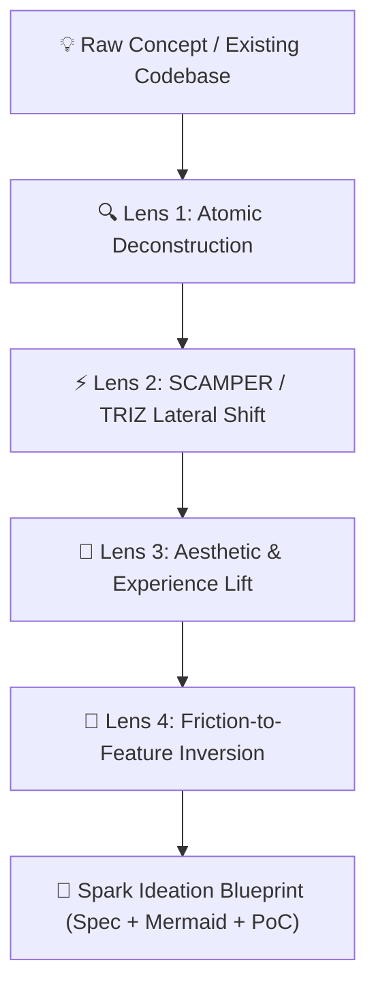

# ⚡ spark — Creative Ideation & Project Evolution Engine

[](LICENSE)
[](https://www.python.org/downloads/)
[](https://github.com/G10DC)
[](#)

`spark` is an advanced **Creative Ideation, Cross-Domain Synthesis & Project Evolution Engine** for developer agents and engineers. It bridges raw concepts with deep system capabilities, generating non-obvious, high-impact features and state-of-the-art architectures.

Designed to work standalone or seamlessly integrated into **Google Antigravity** workflows alongside skills like `sieve` (ETL), `scribe` (OCR/Vision), `artisan` (UI/UX), and local LLMs (**Gemma 4 12B**).

---

## 💡 Why `spark`?

Most AI brainstorming tools produce generic bulleted lists. `spark` uses a **4-Lens Lateral Thinking Framework** to deconstruct your project, cross-pollinate with proven architecture patterns, and invert user friction into breakthrough features.



---

## ✨ Features

- 🧠 **4-Lens Ideation Engine**: Systematic evaluation through Deconstruction, Lateral Shift, Aesthetic Lift, and Friction Inversion.
- 🧩 **Cross-Domain Skill Synergy Matrix**: Automatically maps project requirements to Antigravity ecosystem skills (`sieve`, `scribe`, `artisan`, `keel`, `warden`, `beacon`).
- 🤖 **Off-Grid Local LLM Powered**: Native connector for **Gemma 4 12B** via Unsloth Studio (`http://127.0.0.1:8888`), operating with **zero cloud API costs** and **100% data privacy**.
- 🛠️ **CLI & Python SDK**: Use as a command-line tool or import directly into your Python scripts.
- 📄 **Markdown-First Blueprints**: Generates executable specifications with embedded Mermaid diagrams and proof-of-concept code snippets.

---

## 📦 Installation

```bash
git clone https://github.com/G10DC/spark.git
cd spark
pip install -e .
```

---

## 🚀 Quick Start

### 1. Command Line Interface (CLI)

Run `spark-cli` directly from your terminal:

```bash
spark-cli "Smart Grocery Scraper & Deal Comparer"
```

### 2. Python SDK

```python
from spark import SparkEngine

engine = SparkEngine()
blueprint = engine.ideate("Automated Code Review Bot")
print(blueprint)
```

---

## 🏛️ Architecture Overview

```
spark/
├── spark/
│   ├── __init__.py
│   ├── engine.py          # Core Spark Ideation Engine
│   ├── lenses.py          # 4-Lens Lateral Thinking Implementations
│   ├── skills_matrix.py   # Antigravity Skills Synergy Matrix
│   └── cli.py             # CLI Entrypoint
├── tests/
│   ├── test_engine.py     # Engine Unit Tests
│   └── test_lenses.py     # Lens Unit Tests
├── docs/
│   ├── ARCHITECTURE.md    # Specification & Design Spec
│   └── EXAMPLES.md        # Example Blueprints
├── SKILL.md               # Antigravity Skill Registration
├── pyproject.toml
└── README.md
```

---

## 🧪 Running Tests

```bash
python -m unittest discover tests
```

---

## 📄 License

This project is licensed under the MIT License - see the [LICENSE](LICENSE) file for details.

Developed with ❤️ by **[G10DC](https://github.com/G10DC)**.
