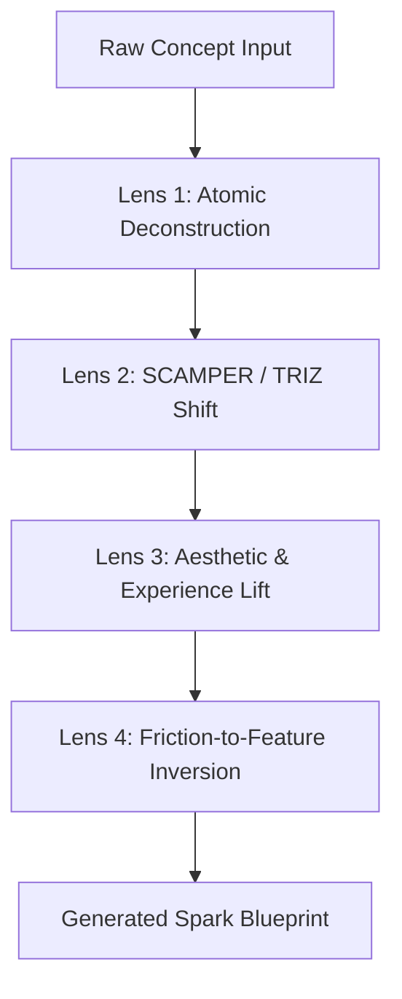

# 🏛️ Architectural Specification: spark Engine

## 1. Overview & Vision
`spark` is an ideation and feature evolution engine designed to elevate project concepts into high-impact, production-grade applications. It relies on lateral thinking frameworks (SCAMPER, TRIZ, Friction Inversion) combined with deep ecosystem skill integration (`sieve`, `scribe`, `artisan`, `keel`, `warden`).

---

## 2. The 4-Lens Lateral Framework

### Lens 1: Atomic Deconstruction
Breaks down any project into five core layers:
1. **Ingestion Layer**: How raw inputs enter the system.
2. **Processing Layer**: Business logic and local LLM transformation.
3. **Persistence Layer**: State management and idempotent storage (`sieve`).
4. **Interface Layer**: User interaction and visual hierarchy (`artisan`).
5. **Security Layer**: Input trust boundaries and audit trails (`keel`/`warden`).

### Lens 2: SCAMPER / TRIZ Shift
- **Substitute**: Replace manual or cloud steps with local offline processing.
- **Combine**: Merge independent capabilities (e.g. OCR + Price Tracker + HTML Dashboard).
- **Adapt**: Reuse patterns from other domains (e.g. financial trading charts applied to grocery prices).
- **Modify**: Scale data processing to micro-batches.
- **Eliminate**: Remove mandatory user clicks through proactive background tasks.
- **Reverse**: Invert constraints into features.

### Lens 3: Aesthetic & Experience Lift
Elevates raw data into state-of-the-art UI/UX standards:
- Glassmorphism dark mode UI.
- Real-time search and zero-latency filtering.
- Micro-interactions and visual status badges.

### Lens 4: Friction-to-Feature Inversion
Transforms user friction into automated features (e.g. manual price checking -> automated alert system).

---

## 3. Integration with Antigravity Skills

| Skill | Role | Integration |
| :--- | :--- | :--- |
| `sieve` | Data Pipeline | Ensures 3-layer data persistence (Raw -> Staged -> Curated) with historical snapshots. |
| `scribe` | Multimodal Vision | Provides OCR and image extraction when structured JSON data is unavailable. |
| `artisan` | UI/UX Engine | Enforces modern design systems and interactive dashboard interfaces. |
| `keel` | Harness & Trust | Manages execution boundaries and audit trails for local tools. |
